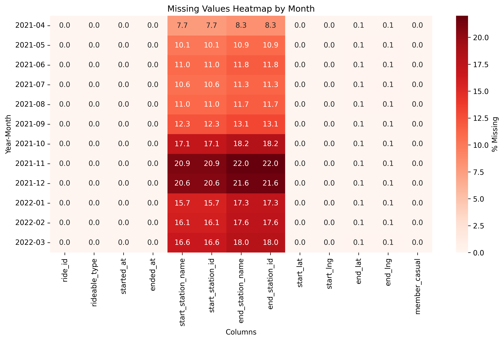
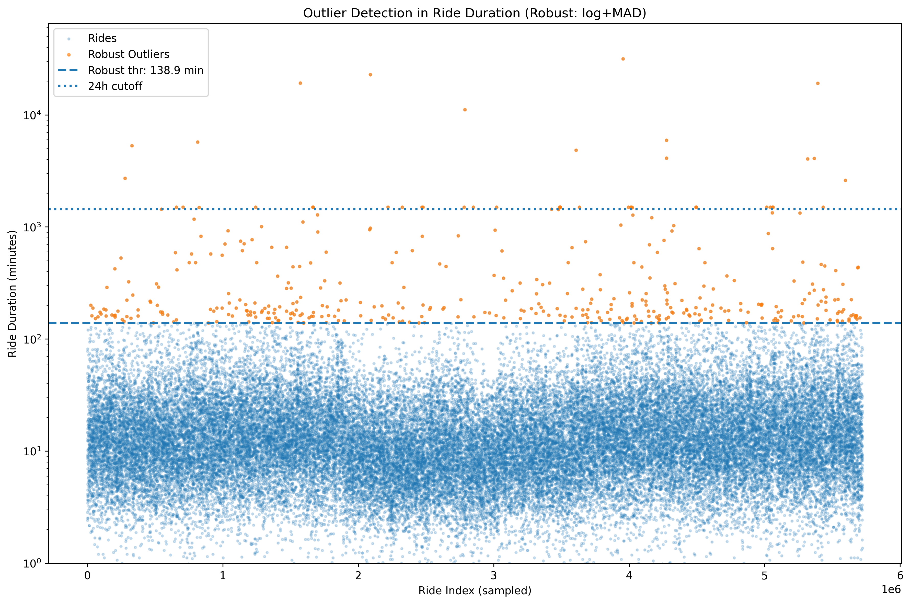
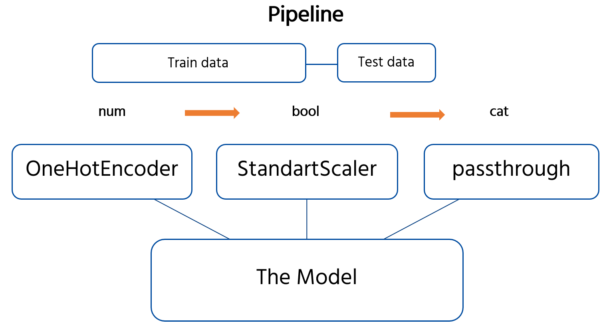
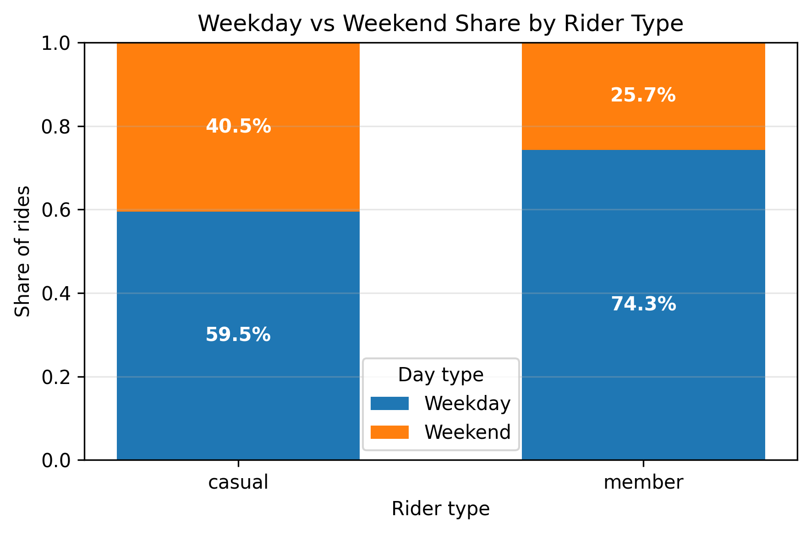
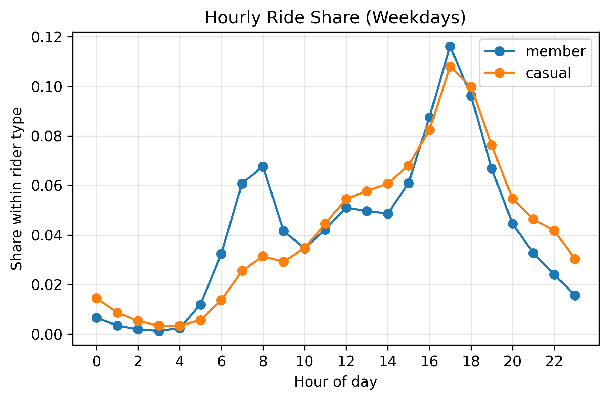
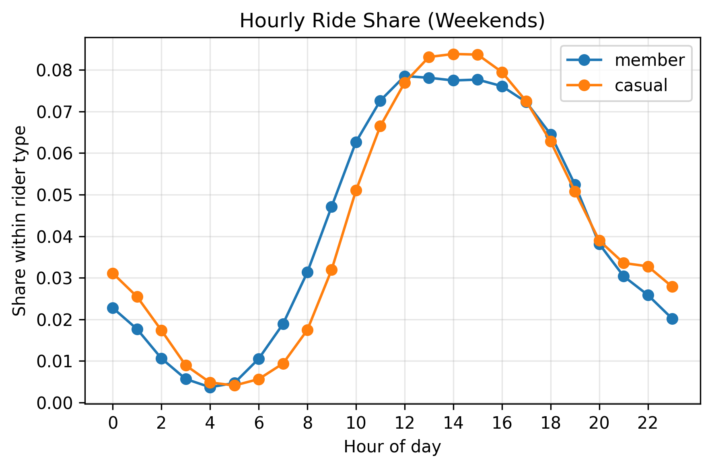
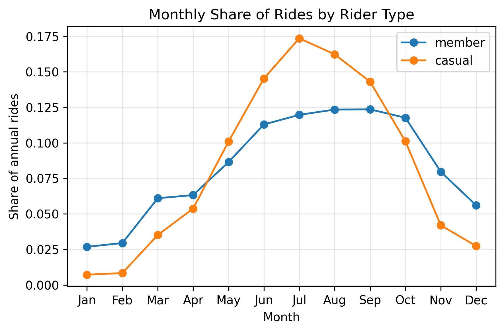
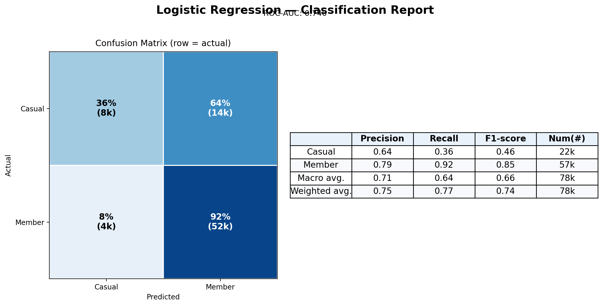
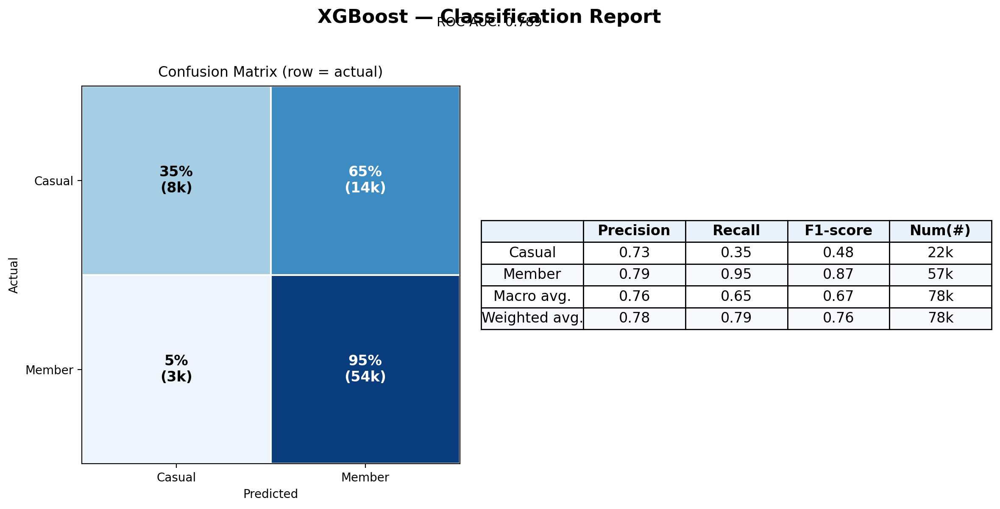

# Cyclistic Bike Share: Understanding Member and Casual Ridership

## Abstract
Cyclistic operates a large station-based bike-share program in Chicago that serves both casual riders and annual members. This term paper synthesizes the end-to-end analytics workflow documented in `1-vibing.ipynb`, spanning raw data ingestion through predictive modeling. We integrate 12 months of trip data (April 2021-March 2022, 5.7 million rides) with hourly weather observations, resolve pervasive station missingness, engineer behavioral features, and evaluate three classifiers that predict membership status. The exploratory analysis highlights sharp behavioral contrasts-weekday commuting by members versus weekend leisure among casual riders, varying bike-type preferences, and weather sensitivity. Random forest and gradient boosting models achieve roughly 0.78 accuracy with high member recall but modest casual recall, steering business recommendations around targeted conversion campaigns, service design, and future analytical improvements.

## 1. Introduction
### 1.1 Business Context
Cyclistic's leadership seeks to convert high-value casual riders into annual members. Casuals pay premium per-ride prices and swell demand on summer weekends, whereas members produce predictable weekday revenue. Understanding how the two segments differ operationally and behaviorally is key to designing marketing interventions and optimizing fleet availability.

### 1.2 Analytical Objectives
We focus on four connected goals:
- Describe demand patterns across rider types, time, weather, and geography.
- Quantify operational anomalies (missing stations, outliers) and clean the record.
- Build supervised models that distinguish member versus casual rides using ride, temporal, and weather signals.
- Translate findings into actions that improve conversion without compromising member experience.

## 2. Data and Methodology
### 2.1 Data Sources
- **Cyclistic trips**: Twelve monthly CSV extracts from Kaggle covering April 2021 through March 2022 (~5.7M rides post-cleaning).
- **Weather enrichment**: Hourly temperature, precipitation, wind, humidity, and cloud cover from the Open-Meteo archive, cached locally under `weather_cache_openmeteo/` to avoid repeated API calls.

### 2.2 Data Preparation Workflow
We consolidated the monthly files into a single dataframe, harmonized column schemas, and appended a `year_month` indicator. Datetime conversion enabled time-based slicing (hour, day, week, month, season). Missing station IDs-7% to 22% per month, largely from dockless e-bikes-were retained and labeled as `Unknown` so that valuable rides remain in scope while the system design difference is explicit. Latitude/longitude fields were nearly complete; only one coordinate fell outside the Chicago bounding box and was removed.

Figure 1. The missing value heatmap shows that station identifiers dominate null counts, whereas temporal and ride metadata are intact. The consistent pattern across months motivated categorical imputation instead of row deletion.

Hourly weather tables were fetched for a ~1 km grid covering the service area (5,685,240 hours total). After merging on rounded start coordinates and ride start hour, forward- and backward-fill within each grid cell ensured complete coverage. Each ride carries both raw and binned weather measures, enabling non-linear effects in downstream models.

### 2.3 Outlier Detection and Cleaning
Ride quality controls removed implausible records while preserving genuine long rides:
- 145 negative durations, 514 zero-minute rides, and 4,138 rides exceeding 24 hours were discarded (<0.2% of rows).
- Distances above 100 km and speeds above 33 km/h (2,157 rides) were treated as GPS or logging errors and removed.
- A log+median absolute deviation (MAD) analysis of duration documented the heavy long-ride tail used in narrative reporting.

Figure 2. Combined box, density, and scatter diagnostics guided exclusion thresholds, ensuring that noise was trimmed without erasing the leisure behavior critical to marketing insights.

### 2.4 Feature Engineering
Key engineered fields include:
- **Ride metrics**: `ride_duration_min`, `ride_distance_km` (Haversine), and derived `speed_kmh`.
- **Temporal context**: `start_hour`, `start_day`, `start_month`, ISO week, `is_weekend`, meteorological `season`, and an `is_rush_hour` indicator (7-9 AM, 4-6 PM).
- **Categorical buckets**: Duration bins (<10, 10-30, 30-60, 60-120, 120+) and weather bins for temperature, precipitation, and wind intensity.
- **Weather**: Continuous temperature (degC), precipitation (mm), wind speed (km/h), relative humidity (%), cloud cover (%), and their categorical bins.

These features support descriptive plots and improve model expressiveness without incurring high dimensionality.

### 2.5 Modelling Pipeline and Evaluation Design
We reserved February-March 2022 as an unseen test set, using April 2021-January 2022 for training to respect temporal order. Both splits were down-sampled to 20% (78,258 total rides) to fit local compute limits while maintaining class balance (21,661 casual vs. 56,597 member rides in the test sample).

A reusable scikit-learn pipeline standardizes numeric features, passes boolean flags, one-hot encodes categorical bins, and feeds the transformed matrix into the estimator. Figure 3 depicts the preprocessing and modeling flow.

Figure 3. The pipeline ensures consistent preprocessing across logistic regression, random forest, and gradient boosting models, simplifying hyperparameter tuning and metric comparison.

## 3. Exploratory Data Analysis
### 3.1 Rider Composition and Bike Preferences

Figure 4. Casual riders over-index on docked and electric bikes, aligning with leisure and tourist behavior, whereas members favor classic bikes for predictable commuting.

### 3.2 Trip Duration Patterns

Figure 5. Median casual ride duration is 16 minutes compared with 9.5 minutes for members, and casual rides exhibit a longer tail-evidence of exploratory weekend journeys.

Figure 6. The trimmed distribution (rides under two hours) confirms that members cluster around short commutes while casual riders sustain higher densities beyond 30 minutes.

### 3.3 Temporal Usage Patterns

Figure 7. Members generate 72% of their rides on weekdays, whereas casual riders produce 61% on weekends, validating the commute versus leisure hypothesis.

Figure 8. Weekday members peak sharply at 8 AM and 5 PM, while casuals show a modest midday bump, reflecting workday travel routines.

Figure 9. Weekend demand shifts toward late morning and afternoon, and casual riders dominate overall volume during these hours, guiding staffing and rebalancing plans.

### 3.4 Seasonal Dynamics

Figure 10. Casual usage is highly elastic to season, surging in summer and collapsing in winter; member demand is steadier, underscoring their resilience to inclement weather.

Figure 11. Month-over-month trends echo the seasonal view and flag shoulder periods (April/October) as prime windows for membership upsell campaigns.

### 3.5 Spatial Patterns

Figure 12. Casual hotspots align with downtown waterfront and tourist corridors, while member density extends into neighborhood commute arteries; overlaying docked-bike availability spots gaps that might deter conversions.

An interactive heat map (`EDA/bike_heatmap.html`) complements the static view, allowing zoomable inspection of micro-markets when presenting to stakeholders.

## 4. Predictive Modelling
### 4.1 Problem Framing
We model membership status (`member`=1, `casual`=0) as a binary classification task. Success is measured by overall accuracy, recall for the casual minority class, and ROC-AUC, balancing marketing needs (identify casuals likely to convert) with operational priorities (maintain member service quality).

### 4.2 Model Performance
Three models were tuned via grid search with stratified cross-validation:
- Logistic Regression (`saga`, class-weight balanced).
- Random Forest (balanced subsample weights, depth and split tuning).
- XGBoost (hist method, scaled positive weight, tuned depth and learning rate).

| Model | Accuracy | Casual Recall | Member Recall | Macro F1 |
|-------|---------:|--------------:|--------------:|---------:|
| Logistic Regression | 0.766 | 0.360 | 0.921 | 0.655 |
| Random Forest | 0.779 | 0.380 | 0.931 | 0.673 |
| XGBoost | 0.786 | 0.354 | 0.951 | 0.671 |

Figure 13. Logistic regression delivers solid calibration with lightweight inference cost but under-recognizes casual rides because the segments overlap in feature space.

Figure 14. The random forest improves casual recall modestly and maintains strong member performance, yielding the best macro F1 among tested models.

Figure 15. XGBoost achieves the highest member recall yet sacrifices casual sensitivity, suggesting value in adjusting decision thresholds or adding cost-sensitive loss terms.

### 4.3 Feature Importance and Interpretability

Figure 16. Coefficient magnitudes highlight that late-night rides, longer durations, weekend usage, and higher temperatures increase the odds of a ride being casual.

Figure 17. Random forest importances underscore speed, rideable type, and duration bins as primary discriminators, consistent with EDA findings.

Figure 18. Gradient boosting emphasizes similar signals while elevating location (longitude) and precipitation indicators, capturing non-linear weather interactions.

Collectively, the models agree on core behavioral markers: commute-friendly time slots, shorter trips, and classic bike usage signify members; weekend, long-distance rides in warm weather point to casual riders.

## 5. Discussion
### 5.1 Conversion Opportunities
- Target weekend hotspots (Navy Pier, lakefront, Lincoln Park) with membership pop-ups and app-based upsell prompts during warm weather.
- Promote hybrid commuting packages to casuals who ride on weekday afternoons, indicating emerging routine usage.

### 5.2 Operational Insights
- Rebalance bikes toward tourist corridors before warm weekends to accommodate casual surges without draining commuter docks.
- Maintain dock availability in the evening rush window, where members account for over 90% of rides in key downtown stations.

### 5.3 Limitations and Future Work
- Casual recall remains below 0.40 across models. Consider threshold tuning, focal loss, or rebalancing (SMOTE, stratified sampling) to capture more leisure rides without overwhelming operations.
- Incorporate station capacity, event calendars, and price elasticity to enrich both descriptive and predictive signals.
- Deploy the pipeline as a scheduled batch score that feeds marketing CRM systems, enabling timely follow-ups after high-value casual trips.

## References
- Kaggle. Cyclistic Bike Share: April 2021-March 2022 trip files. https://www.kaggle.com/datasets/evangower/cyclistic-bike-share
- Open-Meteo. Historical Weather API. https://open-meteo.com/
- Chicago Department of Transportation. Chicago Bike Share System Data Portal (context for operational characteristics).

## Appendix
- Interactive map artifact: `EDA/bike_heatmap.html` visualizes ride start density for live stakeholder demos.
